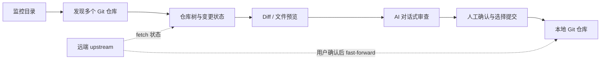

# MulitGit

### 给全栈多仓库开发准备的 AI 代码审查工作台

前端、后端、服务和基础设施散落在不同 Git 仓库里，AI 生成的改动也很容易只看见局部。MulitGit 把多个项目目录放进同一个工作台：先集中发现改动，再逐文件检查 diff，最后让 AI 基于真实变更协助审查代码设计、影响范围和风险。

**仓库归你，审查由你做主。** MulitGit 在本机运行，不自动改代码、不自动提交，也不会在后台替你拉取远端。

```text
多个监控目录  →  全栈仓库树  →  变更与 Diff  →  AI 讨论审查  →  人工确认提交
```

## 为什么做 MulitGit

AI 能很快写出一个功能，但一个全栈功能通常横跨多个仓库：前端页面、后端 API、数据库模型、部署配置可能各改一处。逐个打开仓库，容易遗漏契约不一致、调用链断裂和上线风险。

MulitGit 想提供一个简单的审查入口：

- **把多仓库放到一个视野里**：添加工作目录，自动递归发现其中的 Git 仓库，并以目录树展示；遇到仓库后停止向仓库内部继续扫描，也支持识别 submodule。
- **先看改了什么，再讨论为什么**：文件状态、并排或统一 Diff、Markdown/代码/图片预览都在同一工作台。
- **让 AI 围绕代码变更讨论**：总结当前文件或仓库内全部变更，继续追问设计取舍、上下游影响、潜在风险和需要补充的验证。
- **提交范围清清楚楚**：选择要提交的文件，AI 可按配置的提交规范起草信息；提交前仍由你确认。

> 目前 AI 分析以**单个仓库的 Git diff** 为上下文。工作区可以管理多个仓库；跨仓库自动关联调用链和统一分析是产品方向，不代表当前已实现的自动能力。AI 结论也需要结合源码和实际运行结果人工核验。

## 功能一览

| 工作环节 | MulitGit 提供的能力 |
| --- | --- |
| 整理项目 | 添加多个监控目录，递归发现 Git 仓库和 submodule；目录可按名称、创建时间或修改时间排序 |
| 扫描状态 | 后端定期刷新并缓存仓库状态；本地有修改时在仓库树显示提示 |
| 审阅变更 | 查看变更文件、暂存状态，切换并排 Diff / 统一 Diff |
| 阅读文件 | Markdown 渲染、代码语法高亮、图片预览 |
| AI 代码审查 | 总结单文件或仓库内全部变更；在同一对话中连续追问，Markdown 回复支持代码高亮 |
| 整理提交 | 选择文件提交；按 Conventional Commits 模板和自定义规范生成可编辑的 commit message；支持逐文件撤销修改 |
| 远端协作 | 显示本地领先/落后提交；确认后安全推送或 fast-forward 拉取；无 upstream 时可将当前分支首次发布到 `origin` |
| 阅读体验 | 设置界面字号、代码字体与自动换行 |

## 用 AI 审查 AI 生成的改动

选中仓库后，打开任一变更文件的 **AI 总结** 标签：

1. 选择“当前文件”或“全部修改”。
2. 让模型先概括改动，也可以直接提出审查问题。
3. 沿着同一段对话追问，例如“这个 API 变更可能影响哪些调用方？”、“错误处理和边界条件覆盖了吗？”或“从这些 diff 看，哪些测试最值得补？”
4. 回到 Diff 核对 AI 提到的文件和证据，再决定是否修改或提交。

AI 只拿到所选范围的 Git diff 和本轮对话，不会读取整个仓库。单次发送的 diff 上限为 **512 KiB**；超限时可改为审查单个文件。AI 审查适合帮助发现值得检查的问题，不等同于完整静态分析、安全扫描或测试执行。

## 快速开始

### 运行环境

- Go 1.26 或更高版本
- Node.js 20 或更高版本（开发和构建前端时需要）
- Git 2.30 或更高版本（运行 MulitGit 必需）

### 开发模式

```sh
npm install
npm run dev:server
```

另开一个终端：

```sh
npm run dev
```

打开 <http://127.0.0.1:5173>。Go API 默认运行在 `127.0.0.1:3210`。

### 构建并运行

```sh
npm run build:all
./mulitgit
```

Go 二进制会嵌入前端静态资源；目标机器安装 Git 后即可运行，不需要 Node.js。交叉构建示例：

```sh
# Windows x64
npm run build
GOOS=windows GOARCH=amd64 go build -o MulitGit.exe ./cmd/mulitgit

# macOS Apple Silicon
GOOS=darwin GOARCH=arm64 go build -o MulitGit-macos-arm64 ./cmd/mulitgit

# Linux x64
GOOS=linux GOARCH=amd64 go build -o MulitGit-linux-amd64 ./cmd/mulitgit
```

跨平台构建请在目标平台验证系统 Git、凭据助手和文件权限。当前项目提供 Go 二进制构建，macOS 签名和 Windows 安装包尚未提供。

## 配置 AI 模型

进入右上角设置，填写兼容 **OpenAI Chat Completions API** 的 Base URL、模型名称和 API Key，然后测试连接。AI 总结、连续对话和 commit message 起草共用这份配置。

API Key 与监控目录等设置保存在当前用户的系统配置目录下 `mulitgit/config.json`。发送 AI 请求时，服务会把所选仓库的 diff 和相关对话发送到配置的模型服务；请根据自己的数据要求选择模型服务。

## 局域网访问

默认只监听本机回环地址。如需从局域网其他设备访问，可显式绑定所有网卡：

```sh
MULITGIT_ADDR=0.0.0.0:3210 ./mulitgit
```

MulitGit 当前没有登录认证。绑定 `0.0.0.0` 后，同一网络中能够访问该端口的设备可以查看监控仓库并触发 Git 操作；只应在可信局域网使用，不要直接暴露到公网。

## 工作方式



## 技术栈

- **服务端**：Go、系统 Git CLI、本地 JSON 配置和仓库状态快照
- **界面**：Vue 3、TypeScript、Vite
- **预览**：Marked、highlight.js、DOMPurify
- **模型接口**：兼容 OpenAI Chat Completions API 的服务
- **打包**：Go `embed` 内嵌前端产物，支持 Go 跨平台编译

## 许可证

MulitGit 使用 [MIT License](LICENSE) 开源。第三方依赖仍遵循各自的许可证。

## 项目状态

MulitGit 正在持续迭代，当前重点是把多仓库日常审查流程放进一个本地工作台。欢迎提交问题、体验反馈和改进建议。
